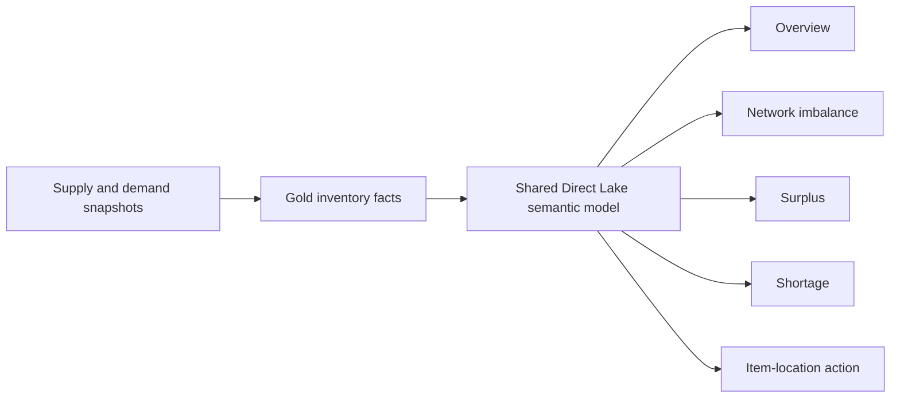
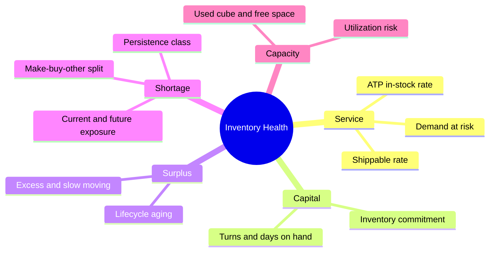

# Inventory Health Control Tower

A Senior/Team Lead case study for balancing service risk, working capital, network imbalance, shortage, surplus, and warehouse capacity in one Power BI decision product.

> [!IMPORTANT]
> This repository contains no real inventory records, financial values, company branding, tenant details, or production report/model exports.

## Executive brief

| | Senior/Lead view |
|---|---|
| Problem | Inventory decisions require balancing service, capital, supply risk, network imbalance, and capacity at product-location-time grain. |
| Product decision | Use a progressive journey from enterprise condition to surplus/shortage diagnosis and accountable item–warehouse action. |
| Main trade-off | Broad risk coverage improves decisions but creates a large semantic/visual surface that needs explicit ownership, performance, and governance. |
| Leadership control | Metric contracts map risk to action owners; release gates cover reconciliation, exclusivity, security, performance, and target binding. |
| Evidence boundary | Seven pages and aggregate metadata are **observed** as of 2026-08-01. KPI examples, thresholds, SLOs, and operating controls are **illustrative/proposed**. |

## System context

## Decision journey

| Page | Decision supported | Exit outcome |
|---|---|---|
| Read Me | Understand definitions and navigation | Shared interpretation |
| Inventory Health Overview | Assess service, capital, inventory, and capacity | Prioritized risk domain |
| Network Imbalance | Find coexisting surplus and shortage | Transfer candidate or exception |
| Surplus | Segment excess, aging, and lifecycle exposure | Rebalance/defer/disposition action |
| Shortage | Separate persistence and source risk | Expedite/source/escalation action |
| Item–Warehouse Detail | Validate product-location drivers | Accountable follow-up context |
| Route Checking | Test movement feasibility | Approved route or escalation reason |

The observed snapshot contains seven pages and 355 report objects, many of them layout/navigation elements. That count is a **performance and maintainability risk signal**, not an achievement: active query visuals, interaction fan-out, matrix cardinality, accessibility, and custom-visual governance require explicit budgets.

## KPI framework

## Quality attributes

| Attribute | Design response | Evidence status |
|---|---|---|
| Correctness | Exclusive/exhaustive risk classes, component reconciliation, current/future boundary | Contract proposed; structures observed |
| Explainability | Gross shortage and surplus stay visible; narratives reconcile to numeric measures | Design principle proposed |
| Performance | Page query budget, matrix limits, interaction review, Direct Lake telemetry | Protocol proposed; latency not disclosed |
| Reliability | Last trusted snapshot, DQ gate, target-binding assertion, rollback | Operating contract proposed |
| Security | RLS/export tests, least privilege, custom/AI visual privacy review | Controls proposed; tenant posture not assessed |
| Changeability | Metric owners, measure lifecycle, ADRs, CI validation | Portfolio implementation included |

## Decisions and trade-offs

- **Separate current and future facts:** temporal clarity is worth additional semantic logic.
- **Keep gross risk primary:** netting shortage and surplus can conceal two large opposing exposures.
- **Pair value and quantity:** price mix must not hide physical operational risk.
- **Map risk to playbooks:** classification without action ownership is not a control tower.
- **Ground AI downstream of metrics:** insights suppress or fall back when freshness, confidence, privacy, or reconciliation contracts fail.
- **Contain diagnostic density:** overview pages get a tighter query budget; detail moves to drill paths.

See [`docs/architecture-decisions.md`](docs/architecture-decisions.md) for alternatives and revisit triggers.

## Repository map

| Path | Purpose |
|---|---|
| [`docs/report-design.md`](docs/report-design.md) | Information hierarchy, decision-to-action flow, and visual governance |
| [`docs/metric-contracts.md`](docs/metric-contracts.md) | Grain, eligibility, cost basis, thresholds, owners, and playbooks |
| [`docs/measure-governance.md`](docs/measure-governance.md) | Lifecycle for the large Inventory Health measure surface |
| [`docs/architecture-decisions.md`](docs/architecture-decisions.md) | Temporal, risk, action, AI, and binding decisions |
| [`docs/operating-model.md`](docs/operating-model.md) | Failure modes, security, performance, release, and decision rights |
| [`docs/testing.md`](docs/testing.md) | Release-blocking test matrix and evidence requirements |
| [`docs/interview-guide.md`](docs/interview-guide.md) | Executive pitch, system-design path, and challenge questions |
| [`report/page-inventory.yaml`](report/page-inventory.yaml) | Sanitized report contract |
| [`samples/dax-patterns.md`](samples/dax-patterns.md) | Synthetic calculation patterns and guardrails |
| [`scripts/validate_portfolio.py`](scripts/validate_portfolio.py) | CI gate for machine contracts, links, syntax, and public-release safety |

## Senior/Team Lead discussion map

- Designing product × warehouse × time facts without temporal overlap or double counting.
- Governing service, capital, shortage, surplus, persistence, and capacity metrics.
- Moving from executive signal to accountable operational action.
- Managing a large measure/visual surface with ownership, testability, and performance budgets.
- Assigning decision rights across business, data, semantic, report, platform, and operations roles.
- Detecting failure, blocking unsafe publication, degrading safely, and rolling back.
- Scaling 10× from measured bottlenecks rather than premature architecture.

## Related case studies

- [Shared Control Tower Semantic Model](https://github.com/vothai17072002/supply-chain-control-tower-semantic-model)
- [Forecast Accuracy Analytics](https://github.com/vothai17072002/forecast-accuracy-analytics)
- [Fabric Medallion Supply Chain Platform](https://github.com/vothai17072002/fabric-medallion-supply-chain-platform)

## Safe portfolio scope

Architecture and aggregate artifact inventory were observed through read-only Fabric metadata. Names and formulas are generalized; no operational identifier, business record, or proprietary report artifact is published. The repository demonstrates architectural reasoning and does not assert individual authorship, team size, adoption, savings, or KPI improvement without approved evidence.
