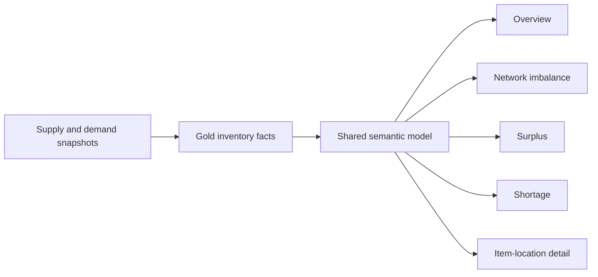
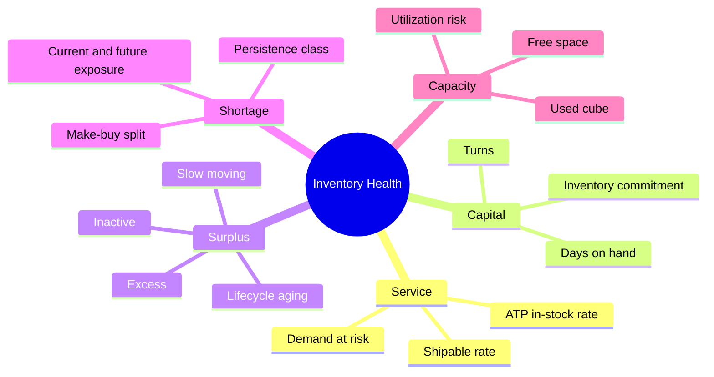

# Inventory Health Control Tower

A Power BI control-tower case study that brings service risk, working capital, network imbalance, shortage, surplus, and warehouse capacity into one decision path.

> [!IMPORTANT]
> This repository documents a sanitized solution design. It contains no real inventory records, financial values, company branding, tenant details, or production report/model exports.

## Business question

Inventory teams need more than an on-hand balance. They must distinguish healthy stock from shortage, surplus, aged exposure, and capacity risk—then identify the product-location combinations that require action.

## Decision journey

| Page | Decision supported |
|---|---|
| Read Me | Understand definitions and navigation |
| Inventory Health Overview | Assess service, capital, inventory, and capacity status |
| Network Imbalance | Find locations where surplus and shortage coexist across the network |
| Surplus | Prioritize excess, aged, slow-moving, and lifecycle exposure |
| Shortage | Separate persistent, semi-persistent, and transient outage risk |
| Item–Warehouse Detail | Validate product-location drivers and next action |
| Route Checking | Review movement paths and operational context |

The verified report snapshot contains seven pages and uses KPI cards, slicers, matrices, bar/scatter/combo charts, a custom Deneb visual, navigation actions, and an AI-insight visual.

## KPI framework

## Repository map

| Path | Purpose |
|---|---|
| [`docs/report-design.md`](docs/report-design.md) | Information hierarchy and page-to-decision mapping |
| [`docs/testing.md`](docs/testing.md) | Data, semantic, UX, and performance validation |
| [`report/page-inventory.yaml`](report/page-inventory.yaml) | Sanitized report contract |
| [`samples/dax-patterns.md`](samples/dax-patterns.md) | Generic inventory-health calculation patterns |
| `.tours/architect-overview.tour` | Guided walkthrough for hiring managers and architects |

## Key design choices

- Separate current snapshot and future-week facts because they answer different temporal questions.
- Conform Product, Warehouse, and Calendar dimensions with the Forecast Accuracy domain.
- Classify risk before visualization so every page uses consistent shortage/surplus logic.
- Pair value and quantity measures to prevent price mix from hiding physical-unit risk.
- Use prior-period and current/future variants consistently across KPI families.
- Add decision narratives after governed metrics, never as a substitute for reconciliation.

## What I can explain in an interview

- Designing a product × warehouse × week analytical grain.
- Combining supply, demand, safety stock, lead time, and inventory commitment.
- Distinguishing persistent versus transient shortage risk.
- Designing drill paths from executive KPI to item-location action.
- Managing a large measure surface with naming conventions and reusable calculation patterns.
- Balancing service, working capital, and storage capacity in one control tower.

## Safe portfolio scope

The architecture and aggregate artifact inventory were verified against a working Fabric implementation. Names and formulas are generalized; no operational identifier, business record, or proprietary report artifact is published.
