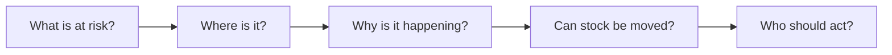

# Inventory Health Control Tower

A Power BI case study for turning inventory signals into clear actions: **rebalance, expedite, defer, source, or investigate.**

The project connects service risk, working capital, shortage, surplus, and warehouse capacity in one decision flow. The README starts with the business problem; technical details are available in the linked documents when you need them.

> [!NOTE]
> This is a privacy-safe portfolio case study. It contains no real inventory records, financial values, company branding, tenant details, or production report files.

## In one minute

Inventory is not simply “too high” or “too low.” The same network can have excess stock in one warehouse, a shortage in another, and no practical route between them.

This control-tower design helps a user move through five questions:

The goal is not more dashboards. The goal is a shorter path from a signal to an accountable decision.

## Choose your path

| If you want to... | Start here |
|---|---|
| Understand the user journey | Read this page, then [`docs/report-design.md`](docs/report-design.md) |
| Check how shortage, surplus, and service metrics work | [`docs/metric-contracts.md`](docs/metric-contracts.md) |
| Understand how hundreds of measures are managed | [`docs/measure-governance.md`](docs/measure-governance.md) |
| Review architecture choices and trade-offs | [`docs/architecture-decisions.md`](docs/architecture-decisions.md) |
| See testing, security, and operating controls | [`docs/testing.md`](docs/testing.md) and [`docs/operating-model.md`](docs/operating-model.md) |
| Prepare for a project walkthrough | [`docs/interview-guide.md`](docs/interview-guide.md) |

## Decisions the report should support

| Signal | Question | Possible action |
|---|---|---|
| Service risk | Which demand may not be fulfilled? | Prioritize, expedite, or escalate |
| Network imbalance | Is stock available somewhere else? | Transfer or record a route exception |
| Surplus | Which stock is excessive, slow-moving, or aging? | Rebalance, defer, or dispose |
| Shortage | Is the risk current, future, persistent, or source-related? | Expedite, source, make, or escalate |
| Capacity | Which location is approaching its practical limit? | Re-slot, redirect, or review inbound plans |

Gross shortage and gross surplus remain visible separately. Netting them too early can make two large problems look like one small number.

## Report journey

The observed report structure contains seven pages:

1. **Read me** — explain definitions and navigation.
2. **Inventory Health Overview** — choose the risk area that needs attention.
3. **Network Imbalance** — find transfer candidates and exceptions.
4. **Surplus** — understand excess, aging, and lifecycle exposure.
5. **Shortage** — separate current, future, and persistent risk.
6. **Item–Warehouse Detail** — validate the drivers at an actionable level.
7. **Route Checking** — confirm whether a proposed movement is feasible.

The snapshot contains 355 report objects, including layout and navigation elements. This is treated as a performance and maintenance constraint, not as an achievement. Overview pages should stay light; detailed analysis belongs in drill paths.

## Metric areas in plain language

- **Service:** Can available stock satisfy demand?
- **Capital:** How much money is tied up, and how efficiently does stock move?
- **Surplus:** What is excessive, slow-moving, or aging?
- **Shortage:** What is missing now or likely to be missing soon?
- **Capacity:** How much usable warehouse space remains?

Definitions such as “current,” “future,” “excess,” and “at risk” must be governed centrally. The [metric contracts](docs/metric-contracts.md) document their grain, eligibility rules, thresholds, owner, and expected action.

## Design choices

- Keep current and future inventory facts separate so time meaning stays clear.
- Show quantity and value together; either one alone can mislead.
- Map every risk class to an owner and a practical playbook.
- Use AI-generated explanations only when freshness, privacy, confidence, and reconciliation checks pass.
- Keep overview pages simple and move detailed tables into focused pages.
- Block a release when totals do not reconcile or the report points to the wrong environment.

See [architecture decisions](docs/architecture-decisions.md) for alternatives and revisit conditions.

## What is in the repository

| Path | What you will find |
|---|---|
| [`docs/report-design.md`](docs/report-design.md) | Page hierarchy, decision flow, and visual rules |
| [`docs/metric-contracts.md`](docs/metric-contracts.md) | Metric definitions, thresholds, owners, and playbooks |
| [`docs/measure-governance.md`](docs/measure-governance.md) | Lifecycle and organization of the measure library |
| [`docs/architecture-decisions.md`](docs/architecture-decisions.md) | Decisions, alternatives, and trade-offs |
| [`docs/operating-model.md`](docs/operating-model.md) | Reliability, security, performance, and ownership |
| [`docs/testing.md`](docs/testing.md) | Tests required before release |
| [`report/page-inventory.yaml`](report/page-inventory.yaml) | Privacy-safe report structure |
| [`samples/dax-patterns.md`](samples/dax-patterns.md) | Generic DAX examples using fabricated objects |
| [`scripts/validate_portfolio.py`](scripts/validate_portfolio.py) | Automated structure, link, syntax, and privacy checks |

## Evidence and limits

The seven-page structure and aggregate metadata counts were observed through read-only metadata on **2026-08-01**. Metric examples, thresholds, service targets, and operating controls are proposed patterns; they are not claims of production performance, savings, or business impact.

## Related projects

- [Shared Control Tower Semantic Model](https://github.com/vothai17072002/supply-chain-control-tower-semantic-model)
- [Forecast Accuracy Analytics](https://github.com/vothai17072002/forecast-accuracy-analytics)
- [Fabric Medallion Supply Chain Platform](https://github.com/vothai17072002/fabric-medallion-supply-chain-platform)
